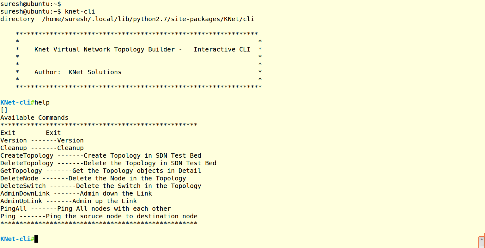
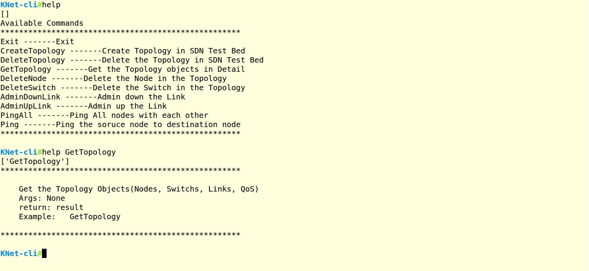
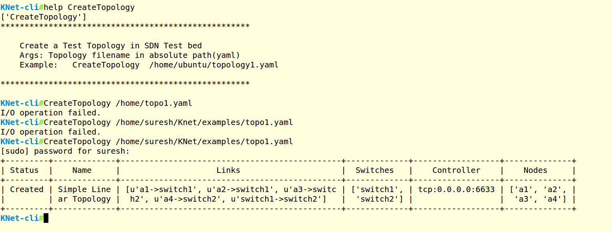
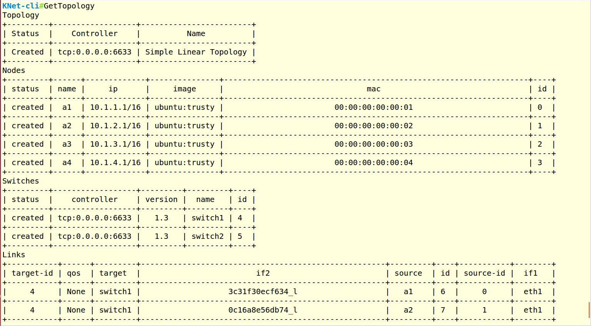
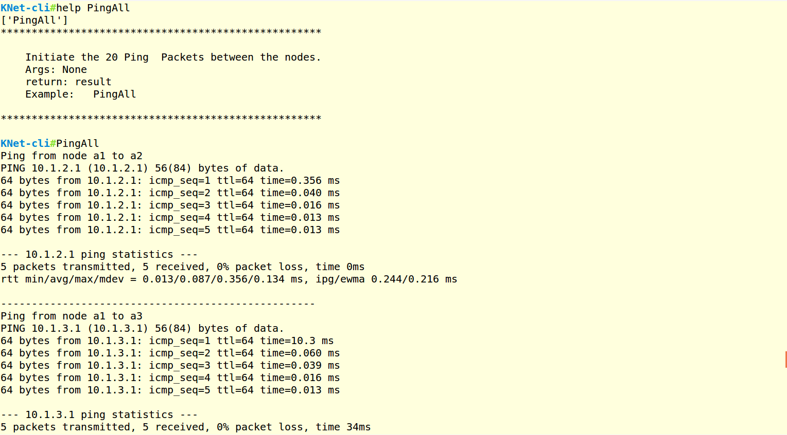
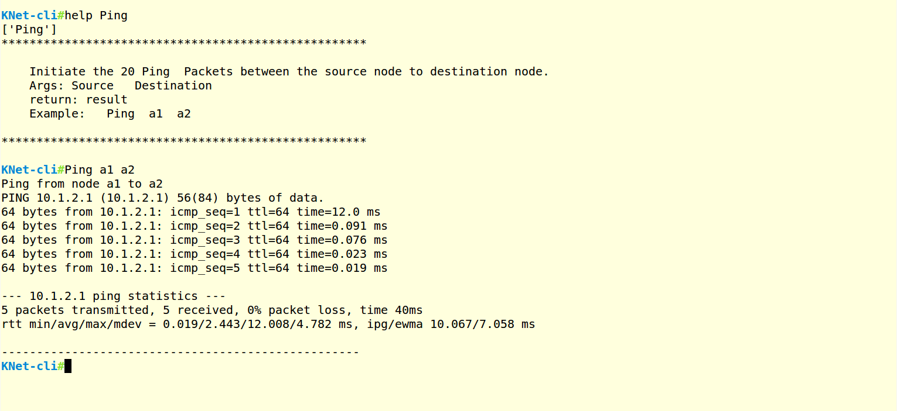
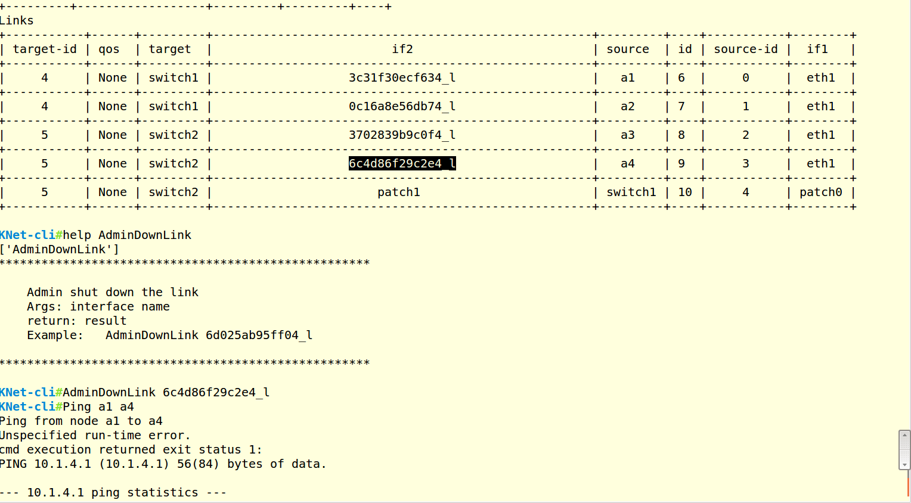
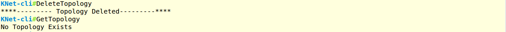

..
	Copyright 2018 KNet Solutions, India, http://knetsolutions.in

	Licensed under the Apache License, Version 2.0 (the "License");
	you may not use this file except in compliance with the License.
	You may obtain a copy of the License at

    http://www.apache.org/licenses/LICENSE-2.0

	Unless required by applicable law or agreed to in writing, software
	distributed under the License is distributed on an "AS IS" BASIS,
	WITHOUT WARRANTIES OR CONDITIONS OF ANY KIND, either express or implied.
	See the License for the specific language governing permissions and
	limitations under the License.

.. contents::
  :depth: 1
  :local:

Command Line Interface
=======================

KNet  CLI is a primary interface for the user to Create/delete/manipulate the Topology. Currently it supports the following commands.

.. code-block:: bash

	Help
	Cleanup
	CreateTopology
	DeleteTopology
	GetTopology
	DeleteNode
	DeleteSwitch
	AdminDownLink
	AdminUpLink
	PingAll
	Ping
	Exit

Start the CLI
--------------
.. code-block:: bash

	knet-cli

Help commands
-------------
Help Command, lists the available commands. 

Help <command name> gives the detailed help for a given command

.. code-block:: bash

	Help
	Help <command name>

Screeshot:

CreateTopology
---------------

CreateTopology command creates a Topology. The Topology input file is defined in YAML format. User can easily define any complex topology by writing the YAML file.(Refer: Topology_file section)

There are few example topologies availale in https://github.com/knetsolutions/knet-example-topologies in the repository.

.. code-block:: bash

	CreateTopology <Topology file>

Note: Topology file needs to be specified in absolute path. Example; /home/ubuntu/mytopology.yaml

Note:
If the Topology file name or Path is not correct, you will see **"I/O operation failed"** Error.

GetTopology
---------------

GetTopology command gives the detailed information of the Topology, such as Node details(Name, IP, Mac, ID), Switch details(name, datapathid),  Link Details(Interface name, Src, Destination).

.. code-block:: bash

	GetTopology

PingAll
---------

PingAll command, generates 5 ping packets from each node to all other nodes.

PingAll
---------

PingAll command, generates 5 ping packets from each node to all other nodes.

Ping
---------

Ping command, generates 5 ping packets from source node to destination node.

.. code-block:: bash

	Ping <source node>  <destination node>

Screenshot:

AdminDownLink
--------------

AdminDownLink command downs the particular link. For example, if want to disconnect the link between node1 to node2, we can use this command.

1. Identify the Interface name for the link using GetTopology Command
2. Use AdminDownLink command with identified interface name to shutdown the link.

.. code-block:: bash

	AdminDownLink  <interface_name>

In this below example, down the a4 interface. 

Screenshot:

AdminUpLink
--------------

AdminUpLink command brings up the link back.

.. code-block:: bash

	AdminDownLink  <interface_name>

In this below example, bring up the a4 interface. 

Screenshot:

DeleteTopology
--------------

DeleteTopology command deletes the entier topology(nodes, switches, links)

.. code-block:: bash

	DeleteTopology

Screenshot:

