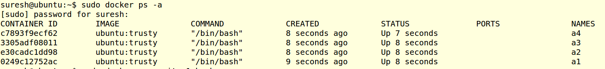
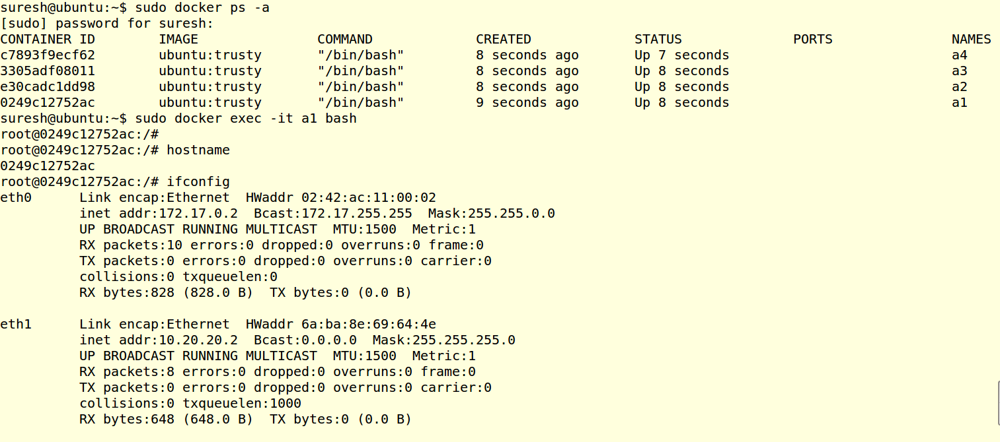
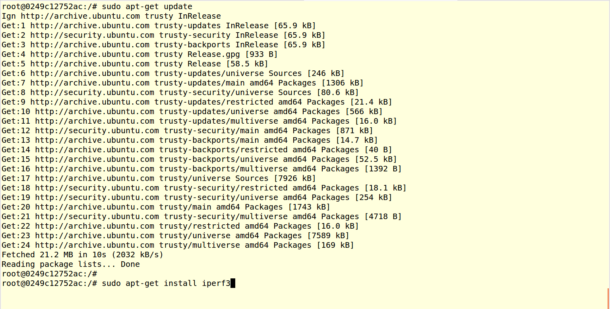
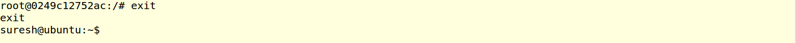

..
	Copyright 2018 KNet Solutions, India, http://knetsolutions.in

	Licensed under the Apache License, Version 2.0 (the "License");
	you may not use this file except in compliance with the License.
	You may obtain a copy of the License at

    http://www.apache.org/licenses/LICENSE-2.0

	Unless required by applicable law or agreed to in writing, software
	distributed under the License is distributed on an "AS IS" BASIS,
	WITHOUT WARRANTIES OR CONDITIONS OF ANY KIND, either express or implied.
	See the License for the specific language governing permissions and
	limitations under the License.

.. contents::
  :depth: 1
  :local:

Useful Docker Commands
=======================

List the Nodes:
-----------------

The following command lists all the nodes.  You can identify the node with "name" names, its same as node name given in the topology file.

.. code-block:: bash

	sudo docker ps -a

Screenshot:

.. _docker-install-package:

How to Install the package(application) in the Node:
------------------------------------------------------
Each node is a Ubuntu Linux Container. So you can execute all the linux commands in the Container once you logged in.

**To Login to the node:**
^^^^^^^^^^^^^^^^^^^^^^^^^^^^

.. code-block:: bash

	sudo docker exec -it <node name> bash
	Example:
	sudo docker exec -it a1 bash

Screenshot:

**To Install the package in the node,**
^^^^^^^^^^^^^^^^^^^^^^^^^^^^^^^^^^^^^^^^^

	First login to the node as mentioned above,

.. code-block:: bash

	apt-get update
	apt-get install <package name>

	Example:
	apt-get install iperf3

Screenshot:

Exit from the node shell
-------------------------

.. code-block:: bash

	exit

Screenshot:

