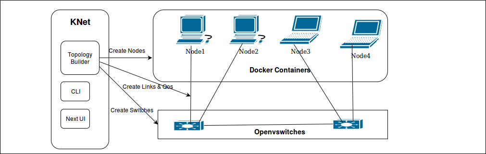

..
	Copyright 2018 KNet Solutions, India, http://knetsolutions.in

	Licensed under the Apache License, Version 2.0 (the "License");
	you may not use this file except in compliance with the License.
	You may obtain a copy of the License at

    http://www.apache.org/licenses/LICENSE-2.0

	Unless required by applicable law or agreed to in writing, software
	distributed under the License is distributed on an "AS IS" BASIS,
	WITHOUT WARRANTIES OR CONDITIONS OF ANY KIND, either express or implied.
	See the License for the specific language governing permissions and
	limitations under the License.

.. contents::
  :depth: 1
  :local:

Overview
========

Software Defined Networking(SDN) opens the innovation in networking domain. University Students/Research fellows does plenty of innovative networking solutions with SDN.

Building the Network Topology for their research activity is still nightmare.

KNet is Virtual Network Topology Builder, it builds the Network Topology as a real network environment.  It means the Nodes are built with Docker Containers. Currently it supports Hosts, Servers, Routers Nodes.

KNet Virtual Network Topology Builder supports building the Traditional Networks as well as SDN Test bed.

Host is built with basic required tools such as iperf, Traceroute, curl, Hping3. Server is built with apache2 webserver. Router is built with Quagga Router.

User can install any required packages (mysql,hacking tools.. etc) in the nodes.
User have full control on the nodes to generate the real time original protocol traffic(no simulation).

Architecture
============

