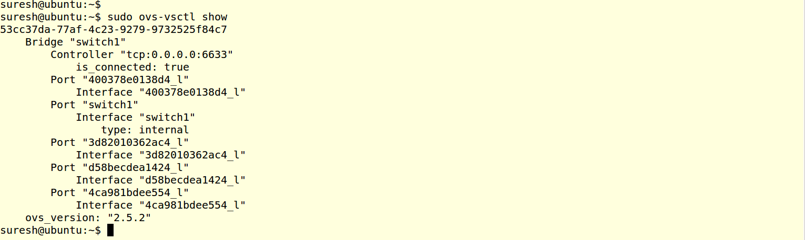
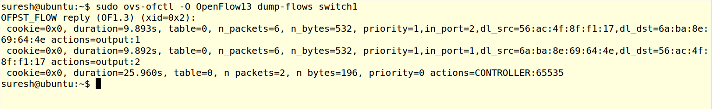

..
	Copyright 2018 KNet Solutions, India, http://knetsolutions.in

	Licensed under the Apache License, Version 2.0 (the "License");
	you may not use this file except in compliance with the License.
	You may obtain a copy of the License at

    http://www.apache.org/licenses/LICENSE-2.0

	Unless required by applicable law or agreed to in writing, software
	distributed under the License is distributed on an "AS IS" BASIS,
	WITHOUT WARRANTIES OR CONDITIONS OF ANY KIND, either express or implied.
	See the License for the specific language governing permissions and
	limitations under the License.

.. contents::
  :depth: 1
  :local:

Useful Openvswitch Commands
============================

List the Switches:
----------------------

The following command lists all the switches.  You can identify the switch with "name" names, its same as switch name given in the topology file.

.. code-block:: bash

	sudo ovs-vsctl show

Screenshot:

List the Flows installed in the Switch
------------------------------------------------------
.. code-block:: bash

	sudo ovs-ofctl -O <openflow version> dump-flows <switch name>

	Example :
	sudo ovs-ofctl -O OpenFlow13 dump-flows switch1

Screenshot:

