..
	Copyright 2018 KNet Solutions, India, http://knetsolutions.in

	Licensed under the Apache License, Version 2.0 (the "License");
	you may not use this file except in compliance with the License.
	You may obtain a copy of the License at

    http://www.apache.org/licenses/LICENSE-2.0

	Unless required by applicable law or agreed to in writing, software
	distributed under the License is distributed on an "AS IS" BASIS,
	WITHOUT WARRANTIES OR CONDITIONS OF ANY KIND, either express or implied.
	See the License for the specific language governing permissions and
	limitations under the License.

.. contents::
  :depth: 1
  :local:

Quick Start
============
In this QuickStart section, we see few quick steps to install and execute the sample topology with RYU Controller.

We have used  Ubuntu 16.04 OS for the below demonstations. (The procedure is same for Ubuntu 14.04 OS also)

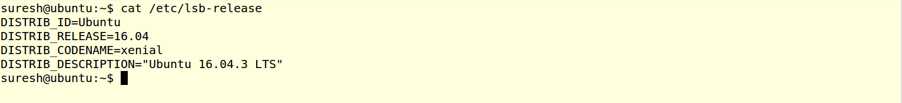

Installation
-------------
1. Install the Prerequisties. Copy and Paste the below command in the Terminal

.. code-block:: bash

	curl https://raw.githubusercontent.com/knetsolutions/KNet/master/install.sh | sh

This command will install the Docker, openvswitch and required packages.

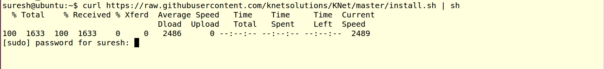

2. Once Prerequisties are installed. Execute the below commands to verify the docker and openvswitches are installed.

.. code-block:: bash

		sudo docker images
		sudo ovs-vsctl show

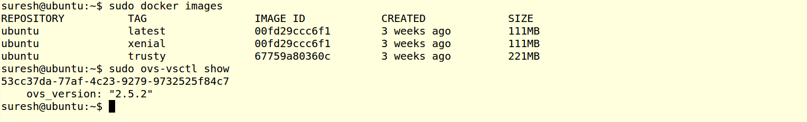

3. Install the KNet Topology Builder with below commands,

.. code-block:: bash

	cd $HOME
	export LC_ALL="en_US.UTF-8"
	virtualenv knet
	. knet/bin/activate
	git clone https://github.com/knetsolutions/KNet
	cd KNet/
	pip install --process-dependency-links .

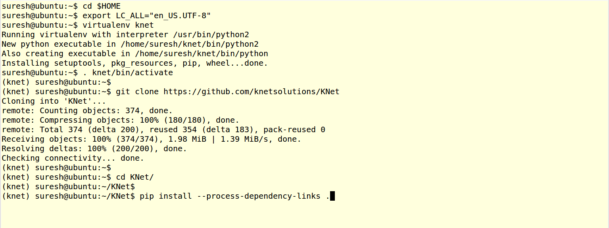

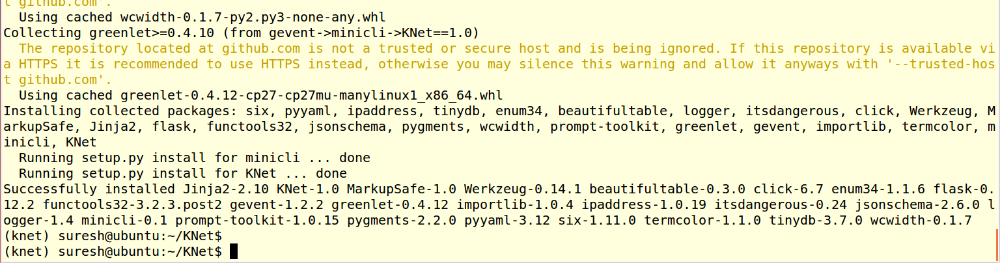

Note: We are installing the KNet in the Virtual Environment. User can install it without virtual environment also.

4. Start the KNet WebUI & and Verify the WebUI in browser 

.. code-block:: bash
	
	python ui/webserver.py >/dev/null 2>&1 &

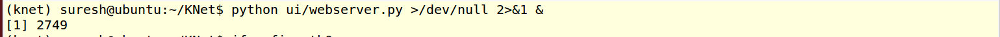

Open FireFox/Chrome, with URL: ĥttp://ip:5000/index.html, and see the empty topology page.

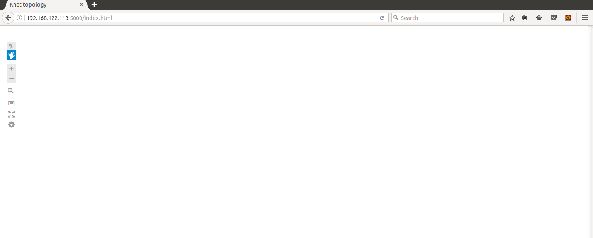

5. Start the KNet CLI and verify the commands

.. code-block:: bash

	python python KNet/cli.py

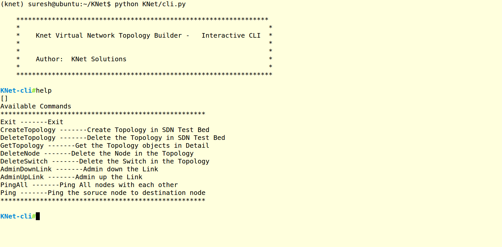

Create a sample Topology and Testing
-------------------------------------
Now Let us Create the Sample Star Topology with RYU SDN Controller.

Star Topology file is available in examples/topo0.yaml

Setup the RYU SDN Controller
^^^^^^^^^^^^^^^^^^^^^^^^^^^^
1. Install the RYU SDN Controller 
Open the another terminal and execute the below commands,

.. code-block:: bash

	cd $HOME
	export LC_ALL="en_US.UTF-8"
	virtualenv ryu
	. ryu/bin/activate
	pip install ryu

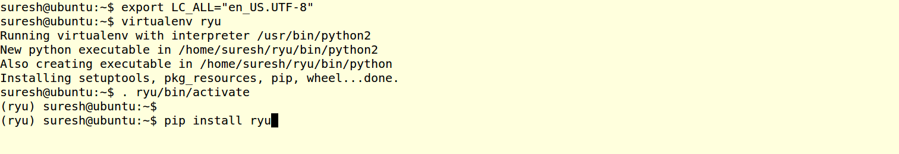

2. Run the Ryu Simple L3 Switch application,

.. code-block:: bash

	ryu-manager ryu/lib/python2.7/site-packages/ryu/app/simple_switch_13.py

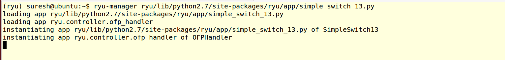

CLI
^^^^^

1. Create a Topology as below in the CLI

.. code-block:: bash

	CreateTopology /home/suresh/KNet/examples/topo0.yaml

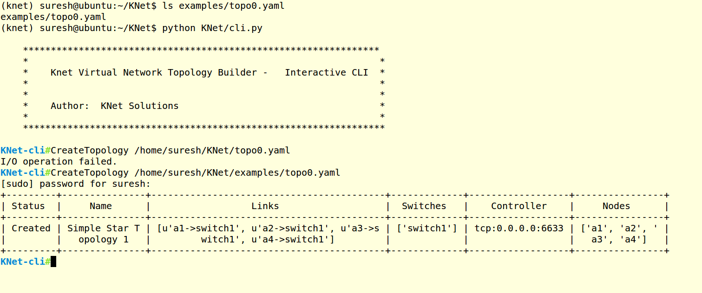

2. Verify the topology digram in UI.
	
	ĥttp://ip:5000/index.html

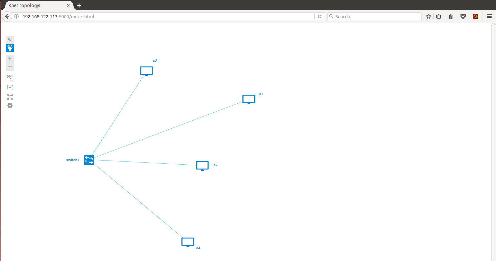

3. Open the another terminal, and verify the switches and nodes.
   Run the below commands in the new terminal and see the created nodes and switches.

.. code-block:: bash

   	sudo docker ps -a
   	sudo ovs-vsctl show

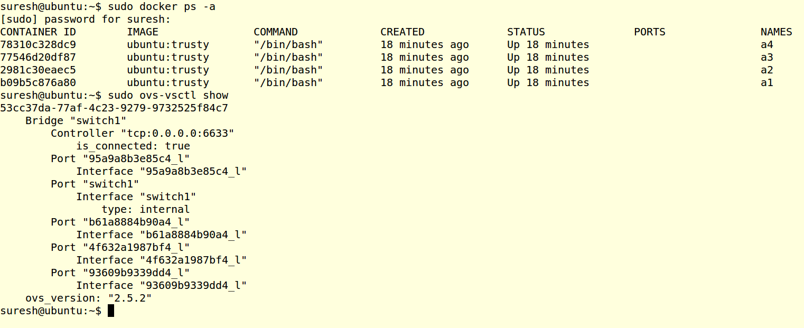

4. Trigger the PingAll command from the KNet CLI and check the output
   Each node pings each other nodes.

.. code-block:: bash

	PingAll

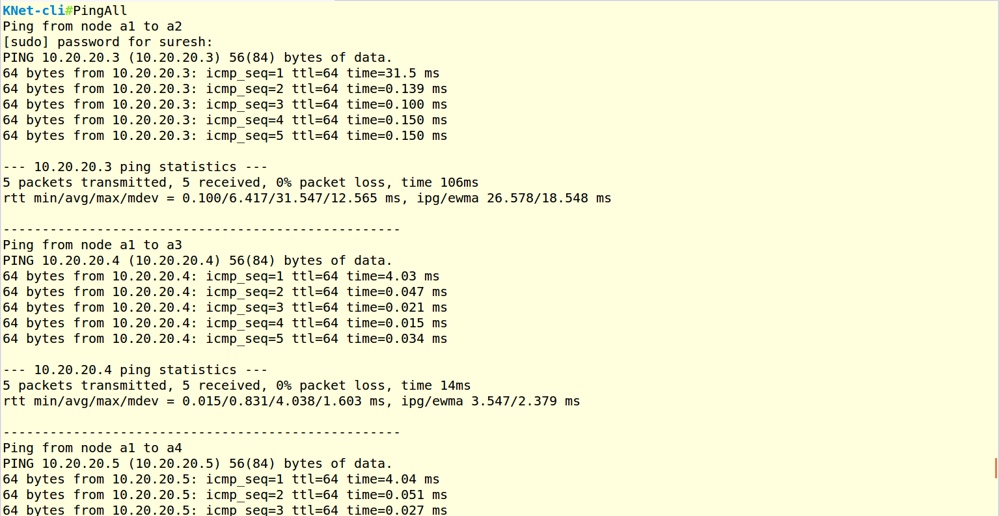

5. Verify the OVS flows with the below command,
	sudo ovs-ofctl -O OpenFlow13 dump-flows switch1

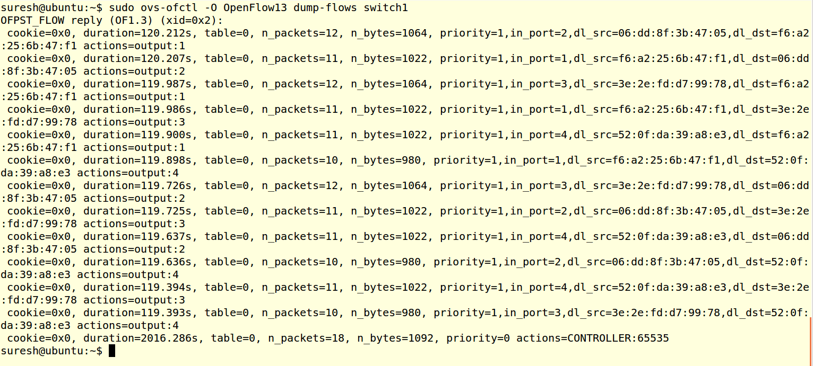

Delete the Topology
---------------------

1. In the KNet CLI, Execute the below command 

.. code-block:: bash

	DeleteTopology

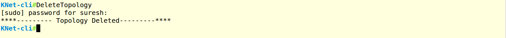

2. Exit from the CLI by "Exit"  Command

