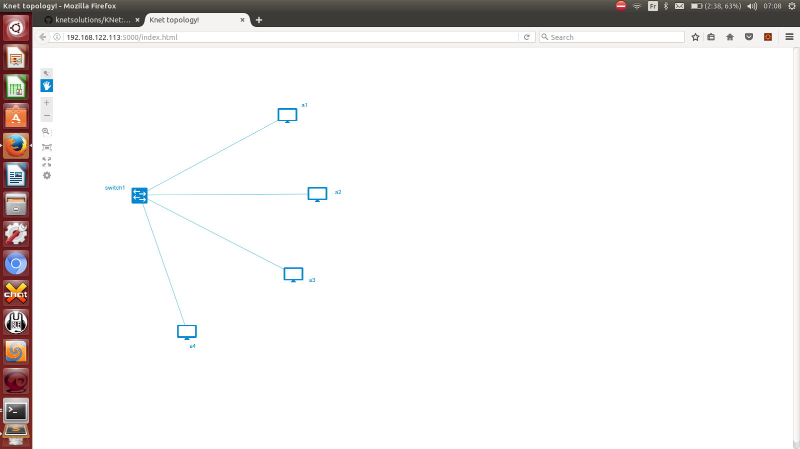
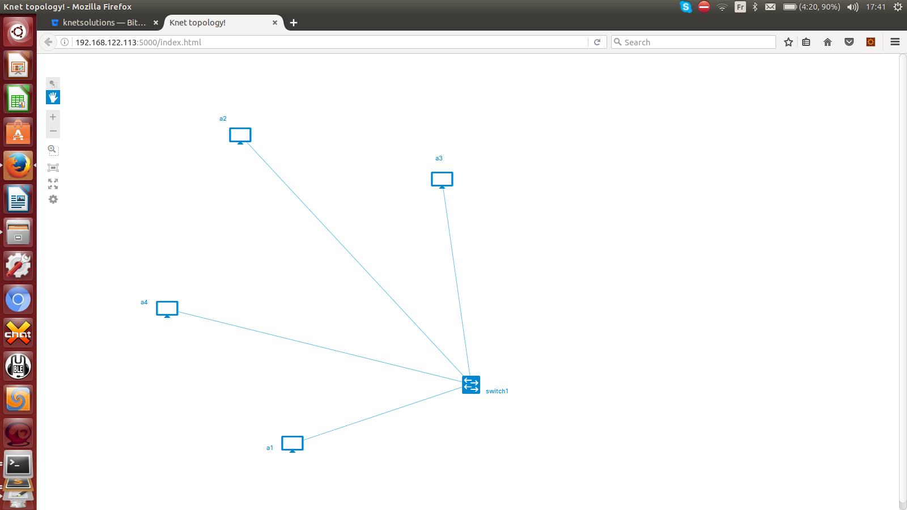
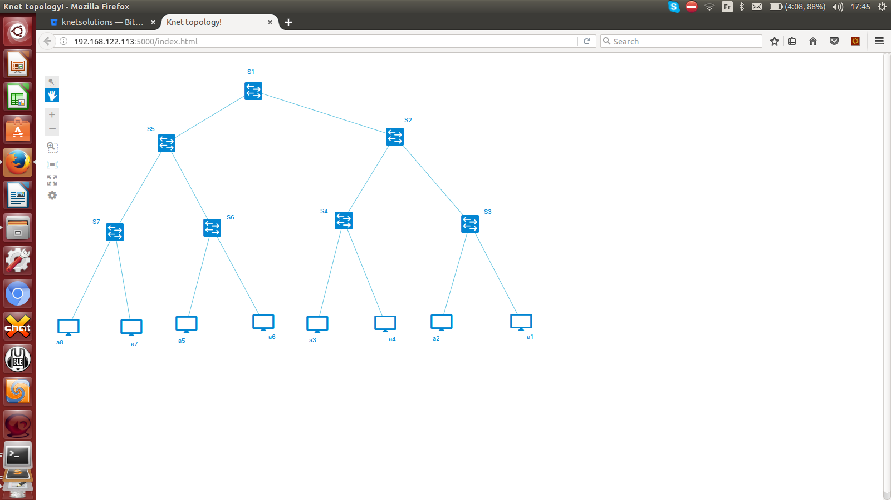

Examples
=========

`../examples` folder consists of 7 examples topology ìnput file.

Star Topology
-------------

Filename: `topo0.yaml`

   Simple Star Topology.

This topology consists of 4 nodes, and a switch. All Nodes are connected to a same switch.

Linear Topology1
-----------------
Filename: `topo1.yaml`

.. figure::  ../imgs/topo1.png
   :align:   center

   Simple Linear Topology.

This topology consists of 4 nodes, and two switches. 2 Nodes are connected in each switch. Also these switches are interconnected. Also MAC address is explicitly  mentioned.

Linear Topology2
-----------------

Filename: `topo2.yaml`

.. figure::  ../imgs/topo2.png
   :align:   center

   Linear Topology with 4 Switches

This topology consists of 4 nodes, and four switches. Each node is connected in each switch. Also these switches are connected linearly and no loop. 

Star Topology with QoS
-----------------------

Filename: `topo3.yaml`

   Simple Star Topology with QoS.

Qos parameters configured in the Star Topology Links.

Ring Topology
-----------------------

Filename: `topo4.yaml`

.. figure::  ../imgs/topo4.png
   :align:   center

   Ring Topology.
      
This topology consists of 4 nodes, and four switches. Each node is connected in each switch. Also these switches are connected linearly and forms the loop.

Full Mesh Topology 
-----------------------

Filename: `topo5.yaml`

.. figure::  ../imgs/topo5.png
   :align:   center

   Full Mesh Topology.

This topology consists of 4 nodes, and four switches. Each node is connected in each switch. Also these switches are interconnected with each other to form a full mesh.

Partial Mesh Topology 
-----------------------

Filename: `topo6.yaml`

.. figure::  ../imgs/topo6.png
   :align:   center

   Partial Mesh Topology.

This topology consists of 4 nodes, and four switches. Each node is connected in each switch. Also these switches are interconnected with some other to form a partial mesh.

Tree Topology 
-----------------------

Filename: `topo7.yaml`

   Tree Topology.

This topology consists of 8 nodes, and 7 switches. This topology forms a binary tree with depth 3. Root Switch is S1. Second level  switches are S2 and S5. Third level switches are S3, S4, S6, S7. Nodes are connected to switches S3, S4, S6  and S7.
