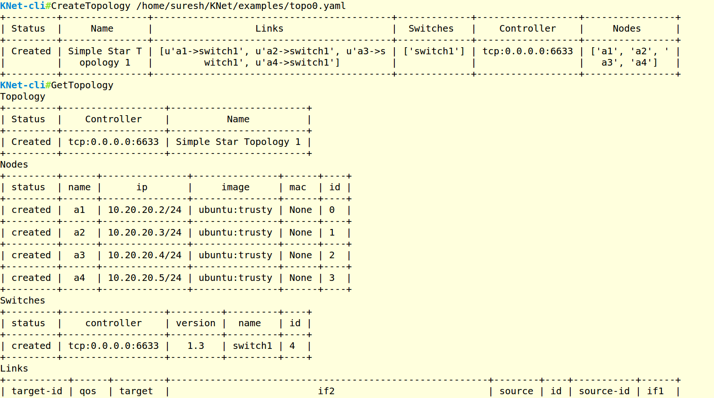
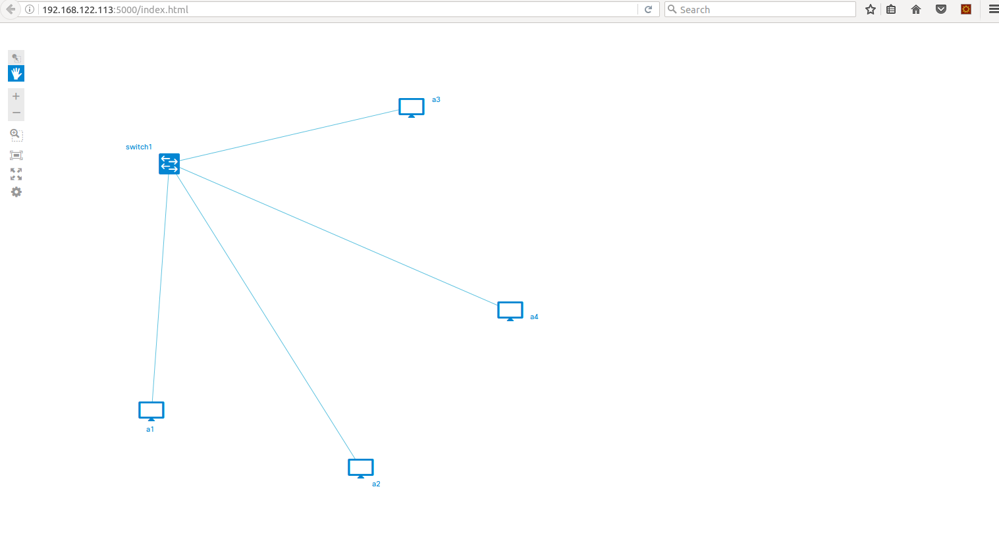
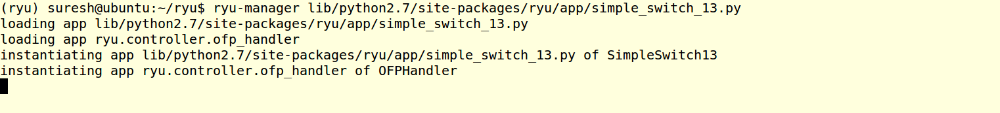
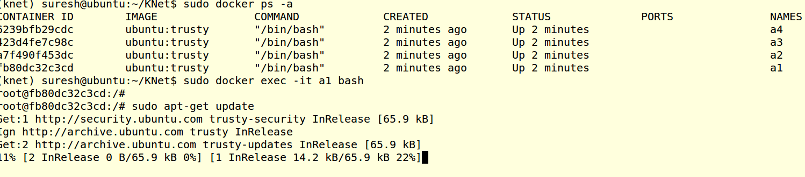
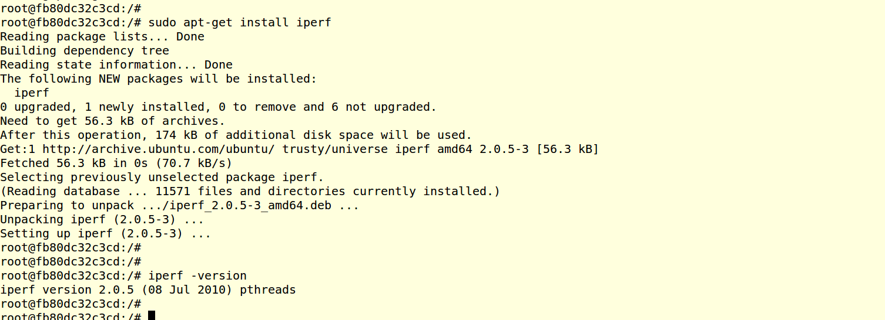
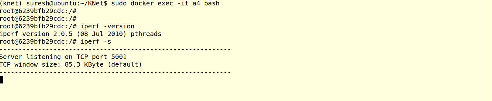
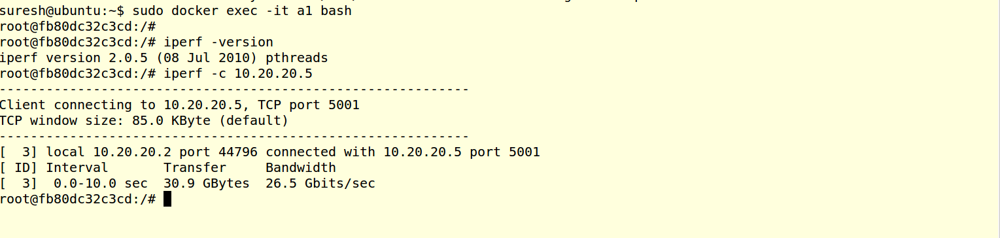
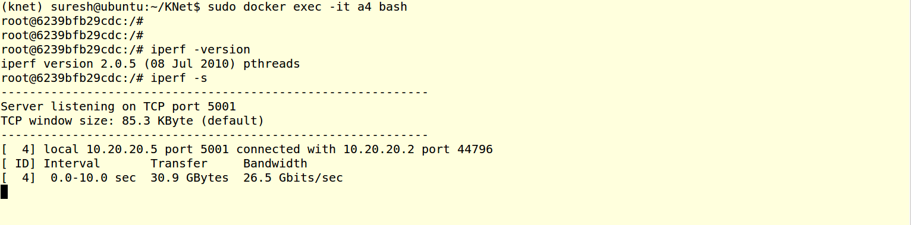
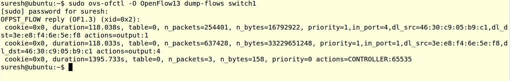

.. contents::
  :depth: 1
  :local:

Traffic Tests
=================

TCP and UDP Tests using IPERF :
------------------------------------

As all nodes are ubuntu nodes, we can just install iperf and start use it. In this below example shows the IPERF traffic gene

Objective is create the example topology0, and generate the IPERF Tests between node a1 and a4.  a4 will act as iperf server, and a1 will act as iperf client.

a1 node ip is 10.20.20.2
a4 node ip is 10.20.20.5

Create the Topology using KNet CLI.
^^^^^^^^^^^^^^^^^^^^^^^^^^^^^^^^^^^^^^^^^^^^^^^^^^^^^^^^

View the Topology Web UI
^^^^^^^^^^^^^^^^^^^^^^^^^^^^^^^^^^^^^^^^^^^^^^^^^^^^^^^^

Start the Ryu Controller SimpleSwitch13 application,
^^^^^^^^^^^^^^^^^^^^^^^^^^^^^^^^^^^^^^^^^^^^^^^^^^^^^^^^

Install the IPERF on a1 node 
^^^^^^^^^^^^^^^^^^^^^^^^^^^^^^^^^^^^^^^^^^^^^^^^^^^^^^^^

.. code-block:: bash

	sudo docker exec -it a1 bash
	sudo apt-get update
	sudo apt-get install iperf

Install the IPERF on a4 node
^^^^^^^^^^^^^^^^^^^^^^^^^^^^^^^^^^^^^^^^^^^^^^^^^^^^^^^^

Repeat the IPERF installation methond mentioned in above step in node a4.

Start the IPERF in a4 node as TCP Server.
^^^^^^^^^^^^^^^^^^^^^^^^^^^^^^^^^^^^^^^^^^^^^^^^^^^^^^^^
.. code-block:: bash

	sudo docker exec -it a4 bash
	iperf -s

Start the IPERF in a1 node as TCP Client.
^^^^^^^^^^^^^^^^^^^^^^^^^^^^^^^^^^^^^^^^^^^^^^^^^^^^^^^^
.. code-block:: bash

	sudo docker exec -it a1 bash
	iperf -c 10.20.20.5

Check the Results.
^^^^^^^^^^^^^^^^^^^^^^^^^^^^^^^^^^^^^
Server Side

Check the OVS flows.
^^^^^^^^^^^^^^^^^^^^^^^^^^^^^^^^^^^^^

References
^^^^^^^^^^^^^^^^^^^^
IPERF supports UDP Traffic tests as well , Below links can help you for udp tests.

1. https://iperf.fr/iperf-doc.php

2. https://openmaniak.com/iperf.php

HTTP Tests Using Apache WebServer & Locust :
---------------------------------------------

Todo
