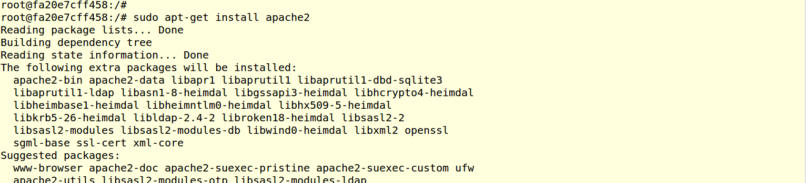
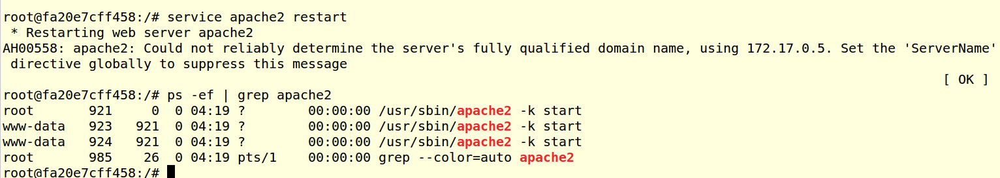
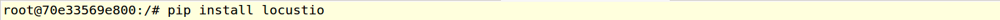
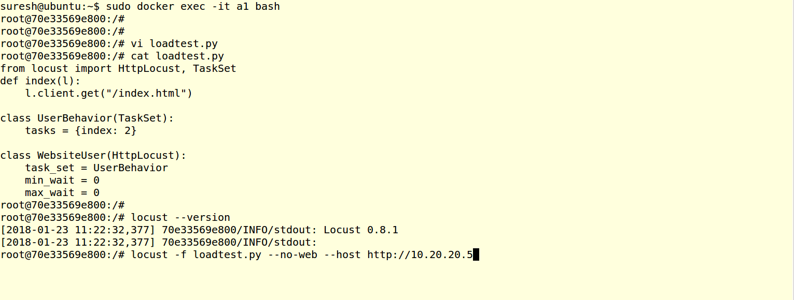
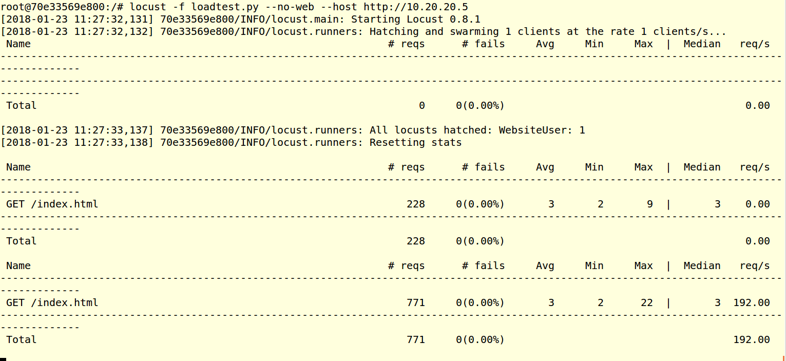
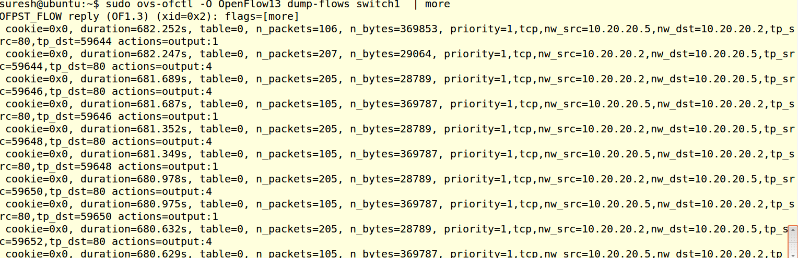
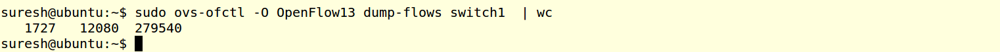

.. contents::
  :depth: 1
  :local:

Traffic Tests
=================

KNet Supports UDP, TCP tests as simple Commands.  KNet runs IPERF in the node to perform this test.

TCP Test :
------------------------------------
TcpTest command performs the TCP test between two nodes for 10s

.. code-block:: bash

    KNet-cli#help TcpTest
    ['TcpTest']
    ****************************************************

    Runs IPERF TCP test.
    Args: source destination  Number-of-connections
    return: result
    Example:  TcpTest a1 a2 1
              TcpTest a1 a2 10
    
    ****************************************************

UDP Test:
------------------------------------

UdpTest command performs the UDP test between two nodes for 10s

.. code-block:: bash
  
    KNet-cli#help UdpTest
    ['UdpTest']
    ****************************************************

    Runs IPERF UDP test.
    Args: source destination  Bandwitdh(Mbps) Number-of-connections
    return: result
    Example:  UdTest a1 a2 10 1
              UdpTest a1 a2 1 1
    
    ****************************************************

References
^^^^^^^^^^^^^^^^^^^^
IPERF supports UDP Traffic tests as well , Below links can help you for udp tests.

1. https://iperf.fr/iperf-doc.php

2. https://openmaniak.com/iperf.php

HTTP Tests Using Apache WebServer & Locust :
---------------------------------------------

As all nodes are ubuntu nodes, we can just install Apache Webserver and Locust https://locust.io/ (HTTP Load Testing Tool) start using it. 

Objective is create the example topology0, and Install the Apache Web Server in a4 node.   Install Locust in a1 node.  Trigger the Locust to test the apache web server(a4). Locust will generate huge http connections to the Apache web server and load it.

a1 node ip is 10.20.20.2
a4 node ip is 10.20.20.5

Create the Topology using KNet CLI.
^^^^^^^^^^^^^^^^^^^^^^^^^^^^^^^^^^^^^^^^^^^^^^^^^^^^^^^^

.. figure::  imgs/traffic/topology_cli_s.png
   :align:   center

View the Topology Web UI
^^^^^^^^^^^^^^^^^^^^^^^^^^^^^^^^^^^^^^^^^^^^^^^^^^^^^^^^

.. figure::  imgs/traffic/topology_ui_s.png
   :align:   center

Start the Ryu Controller L4Switch application,
^^^^^^^^^^^^^^^^^^^^^^^^^^^^^^^^^^^^^^^^^^^^^^^^^^^^^^^^

L4Switch(https://github.com/knetsolutions/knet/L4Switch.py) application creates flow based on srcip, dstip, protocol,srcport, dstport. 

.. figure::  imgs/traffic/ryu_l4_s.png
   :align:   center

Install the Apache WebServer on a4 node 
^^^^^^^^^^^^^^^^^^^^^^^^^^^^^^^^^^^^^^^^^^^^^^^^^^^^^^^^

.. code-block:: bash

  sudo docker exec -it a4 bash
  sudo apt-get update
  sudo apt-get install apache2
  sudo service apache restart

Install the Locust Tool on a1 node
^^^^^^^^^^^^^^^^^^^^^^^^^^^^^^^^^^^

.. code-block:: bash

  sudo docker exec -it a1 bash
  sudo apt-get update
  sudo apt-get install python-dev python-pip
  sudo pip install locustio

Run the Locust HTTP Load test 
^^^^^^^^^^^^^^^^^^^^^^^^^^^^^^^^^^^
In the a1 node, Create a locust input file (loadtest.py)

.. code-block:: python

  from locust import HttpLocust, TaskSet
  def index(l):
      l.client.get("/index.html")

  class UserBehavior(TaskSet):
      tasks = {index: 2}

  class WebsiteUser(HttpLocust):
      task_set = UserBehavior
      min_wait = 0
      max_wait = 0

Start the locust as below,
10.20.20.5 is a4 IP

.. code-block:: bash

  locust -f loadtest.py --no-web --host http://10.20.20.5
  

The output shows , how many connections per second requested and the response time, etc.

Check the flow tables in ovs

.. code-block:: bash

  sudo ovs-ofctl -O OpenFlow13 dump-flows switch1
  sudo ovs-ofctl -O OpenFlow13 dump-flows switch1 | wc

I could able to simulate around 2000 Flows in 2 minutes. we can test flow setup rate using this test.

